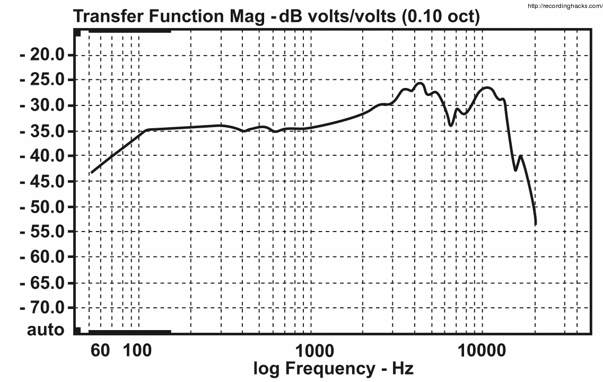
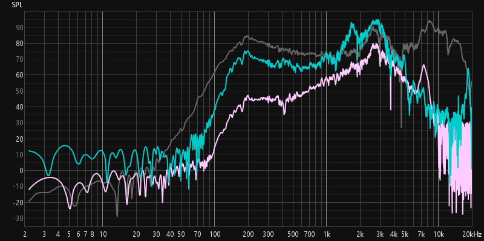
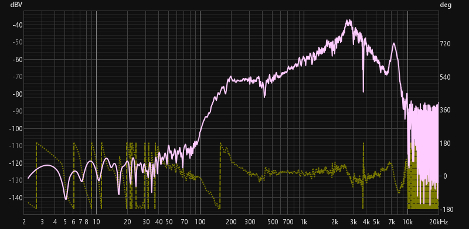
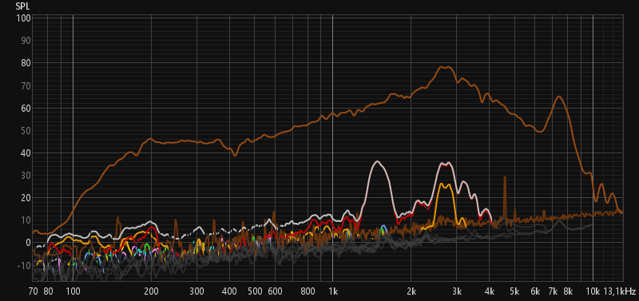
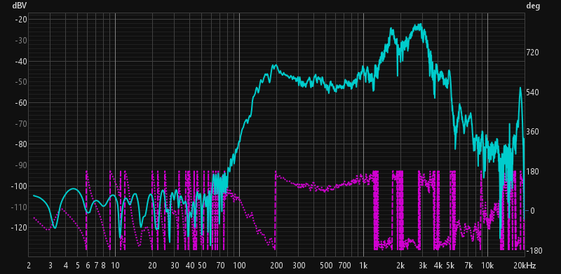
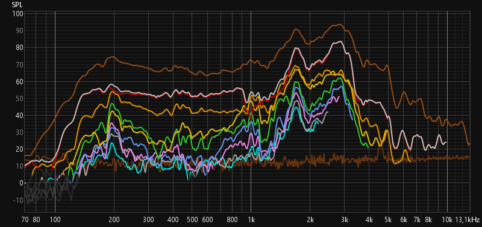

# Measurements

## Methods

The frequency response of the two microphones was measured using [Room EQ Wizard (REW)](https://www.roomeqwizard.com).

The setup consisted of:
- A Fender Acoustasonic 15 (15 W acoustic guitar amplifier)
- A Behringer Xenyx QX1002USB (mixer with integrated audio interface)

REW generated a sweep signal that was played back through the amplifier.  
Each microphone was connected to the mixer, and REW captured the recorded signal multiple times. The measurements were then averaged and used to generate the frequency response plots.

    

  

A Behringer XM8500 was used for calibration, taking the manufacturer's declared frequency response as a reference.

  
*Behringer XM8500 – declared frequency response*

The noise profile was taken into account during the measurements.

In the graphs below, the following legend is used:

- Carbon Mic
- Dynamic Mic
- Behringer XM8500 (Reference)

## Results

*Comparison of all frequency responses*

The comparative analysis highlights the "Lo-Fi" nature of the telephone capsules compared to the reference (grey). Both show a steep roll-off below 100 Hz and above 5-7 kHz, concentrating most of the energy within the vocal bandwidth.

---

### Dynamic Mic

*Dynamic capsule frequency response and phase*

The dynamic capsule (≈55 Ω) exhibits a more controlled response compared to the carbon element:

* **Frequency Response:** It shows a rising emphasis from 200 Hz up to a pronounced peak around **2.5 - 3 kHz**, which is engineered to maximize speech intelligibility.
Beyond 4 kHz, the response decays rapidly, with a final resonance peak near 7-8 kHz before dropping off almost entirely above 10 kHz.
* **Distortion Profile:** * The dominance of the **2nd harmonic** suggests a distortion perceived as "warmer" or less aggressive.
    * The peak in the **2–4 kHz** range directly influences the perception of presence and "bite" in the signal.
    * Overall, it maintains a progressive profile without sudden bursts of high-order harmonics.

*Dynamic Capsule Distortion Analysis*
  

---

### Carbon Mic

*Carbon capsule frequency response and phase*

The carbon capsule (≈100 kΩ) embodies the authentic "vintage telephone" sound due to its non-linear nature:

* **Frequency Response:** It is significantly more irregular than the dynamic capsule. The presence peak is narrower and centered tightly around **3 kHz**, with a much sharper drop-off in both low and high frequencies.
Powered by the 9V bias, the resistance variations of the carbon granules create a very aggressive modulation of the signal, giving the capsule a high gain. 
* **Distortion Profile:**
    * **Higher overall harmonic content:** The THD (Total Harmonic Distortion) is significantly higher than that of the dynamic capsule. The main contribute is given by the **2nd harmonic**. After that, the **3rd and 4th harmonics** 
    * **Consistency:** The higher-order harmonics (5th, 6th, 7th) remain constant and audible, contributing to the characteristic "grit" of carbon microphones.
    * The distortion spectrum is more complex and noisier, making it ideal for creative lo-fi textures.

*Carbon Mic Distortion Analysis*
  

### Equalization Advice

//todo

## Threats to Validity

Several factors may have influenced the precision of these measurements. Firstly, the **amplifier's own frequency response** was not subtracted from the final data, meaning the results represent the combined "fingerprint" of the Fender Acoustasonic and the microphones rather than the capsules in isolation. 
**Environmental acoustics** and potential **quantization errors** from the Behringer interface's ADC/DAC conversion could introduce artifacts, especially in the high-frequency range. Additionally, the lack of **rigorous error propagation calculations** and the presence of **EMI/RFI noise** on the unbalanced cables (typical of high-impedance carbon elements) mean that the THD values should be treated as qualitative indicators of "character" rather than absolute laboratory metrics. 
Finally, the calibration against the XM8500 assumes the reference mic perfectly matches its factory spec sheet, which may vary slightly due to manufacturing tolerances.
